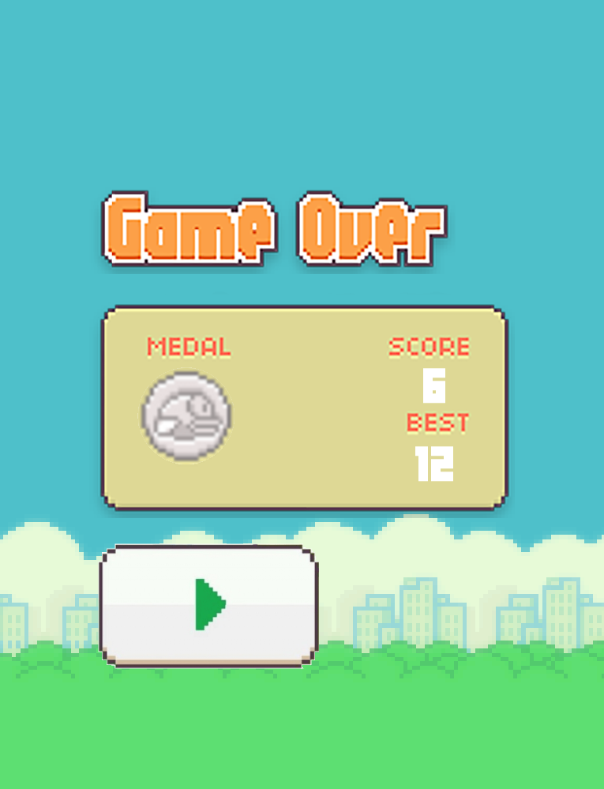

# 🐤 Flappy Bird Clone

A clone of the classic **Flappy Bird** game built using **C++** and **SFML**.  
The project demonstrates game state management, sprite animation, collision detection, and event handling in SFML.

---

## 📸 Screenshots

### 🏠 Main Menu

<br>


### 🕹️ Gameplay

<br>

### 💀 Game Over

<br>

---

## 🎮 Features

- Smooth **bird animation and physics**
- Dynamic **pipe spawning and moving**
- **Collision detection** between bird, pipes, and ground
- **Score tracking** and persistent **High Score** system
- Simple **state machine** architecture:
  - Main Menu
  - Game State
  - Game Over State
- Custom **HUD** showing live score

---

## ⚙️ Technologies

- **Language:** C++17  
- **Library:** [SFML 3.0.0](https://www.sfml-dev.org/) 
- **IDE:** Visual Studio

---

## 🚀 How to Run

1. **Clone the repository or download it as a ZIP file:**
   ```bash
   git clone git@github.com:Obliviann17/Fluppy-Bird-Clone.git
   ```

2. **Open the project in Visual Studio**
   - Open the `FlappyBird.sln` file.
   - Wait for Visual Studio to load all project files.

3. **Play!**
   - Press `Left Click` to make the bird fly  
   - Avoid pipes and ground to increase your score  
   - Beat your **High Score**!

---

## 🧩 Controls

| Action | Key / Mouse |
|---------|--------------|
| Jump | `Left Click` |
| Exit | `Close window` |

---
